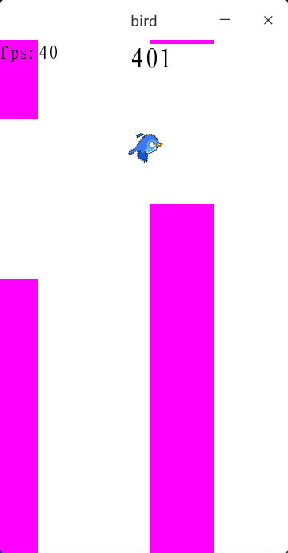

# flappybird
一个极其丑陋的带有Q-Learning的flappybird  
使用rust和sfml编写  
空格：开始/跳跃（死亡不生效）  
R:重新开始(死亡时生效)  
Q:启用/关闭Q-Learning  
D:从标准输入读入一个训练集  
X:输出当前训练集到标准输出  
Up:提高帧率  
Down:降低帧率  
（每次+-40帧，0帧为无帧率限制）  

相比之前那个flappybird(github.com/zhufengning/flappybird)改动较大并且不打算同步过去了  
之前那个没有帧率限制，采用计时器控制小鸟位移，比较流畅，但是写Q-Learning的会炸可能我还需要学习一个  
这个直接用帧率来算位移，有点low  
最后附张训练了一晚上的成果图（这张图用的还是老版本UI）  
